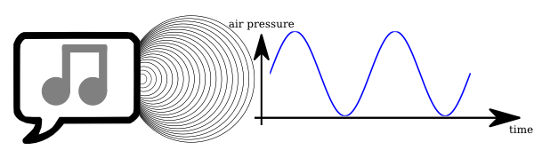
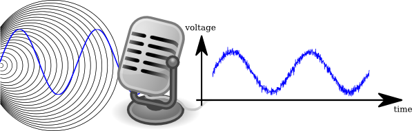
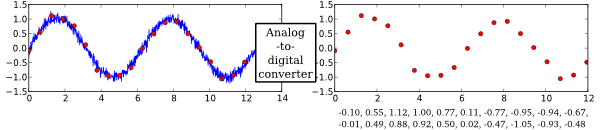
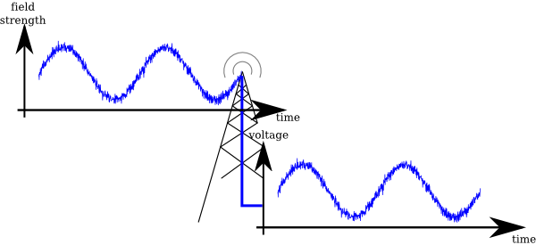
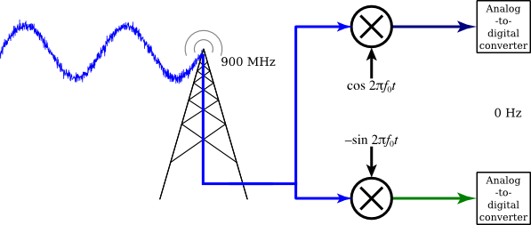
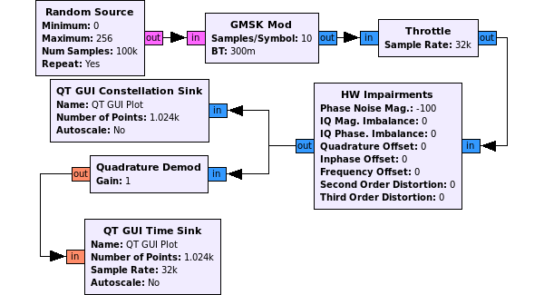
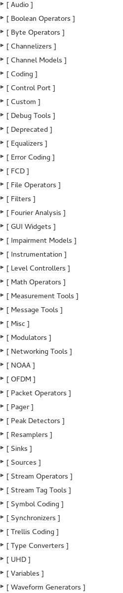

What is GNU Radio?
==================

GNU Radio is a framework to develop software applications for the processing of radio signals. It enables users to build highly capable real-world systems that do audio processing, form mobile communication devices, track satellites, do radar and much more, all in computer software.

It is a highly modular, flow graph-oriented framework that comes with a comprehensive set of functionality that can be readily combined to make complex signal processing applications.

It is by itself not a solution to talk to any hardware, do a specific radio standard or decode a specific transmission, but it can be (and has been) used to develop implementations of basically any band-limited communication standard.

Examples include the decoding of aircraft security broadcasts, GSM transmission, Digital Radio Mondiale, Radar Applications as well as WiFi functionality.

Why would I want GNU Radio?
---------------------------

Formerly, when developing radio communication devices, the engineer had to develop a specific circuit for detection of a specific signal class, design a specific IC that would be able to decode or encode that particular transmission and debug these using costly equipment.

Software Defined Radio takes the analog signal processing and moves it, as far as physically and economically feasible, to processing the radio signal on a computer using algorithms in software.

You can of course use your computer-connected transmitter device in a program you write from scratch, concatenating algorithms as you need them and moving data in and out yourself. But this quickly becomes cumbersome: Why are you reimplementing this standard filter? Why do you have to take care how you move the data between these algorithms? Wouldn't it be smarter to use highly optimized implementations rather than writing things yourself? And how do you get your program to scale well on a multicore architecture for testing but also run fast on an embedded device consuming but a few watts of power?

Enter GNU Radio: A framework *dedicated* to writing signal processing applications for commodity computers. Wrapping functionality in easy to use, fast to develop and completely reusable blocks, offering excellent scalability, an extensive library of standard algorithms, being heavily optimized for the most common platforms, and coming with a large set of examples to get you started.

Digital Signal Processing
=========================

As a software framework, GNU Radio works on digitized signals to generate communication functionality using general purpose computers.

### A little signal theory

Doing signal processing in software requires the signal to be digital. But what is a digital signal?

To understand better, let's look at a typical scenario: Recording voice for transmission using a cellphone.

This starts the sound, being waves of varying air pressure, being generated by the vocal chords of a human. A time-varying physical size like the pressure is what is defined as a *signal*.

When the waves reach the microphone, it converts the varying pressure into an electrical signal, a variable voltage:

Now that the signal is electrical, silicone chips can work with it. We call a signal like that *analog*. But a computer can't yet deal with it; for computational processing, a signal has to be *digital*, which means two things:

1.  It only takes one of a limited number of values at a time, and
2.  it is only being present for discrete points in time.

This digital signal can thus be represented by a sequence of numbers, called *samples*. A fixed time interval between samples lead to a signal *sampling rate*.

The process of taking a physical quantity (voltage) and converting it to digital samples is done by an Analog-to-Digital Converter (ADC). The complementary device, a Digital-to-Analog Converter (DAC), takes numbers from a digital computer and converts them to an analog

Now that we have a sequence of numbers, our computer can do anything with it. It might, for example, apply digital filters, compress it, recognize speech or transmit the signal using a digital link.

### Applying Digital Signal Processing to Radio Transmissions

The same principles as for sounds can be applied to radio waves:

A signal, here electromagnetic waves, can be converted into a varying voltage using an antenna.

This electrical signal is then on the carrier frequency, which is usually several Mega- or even Gigahertz.

After shifting that signal from that frequency down to zero, we get two signals that we can interpret as complex signal. We call this signal complex baseband.

Using two ADCs, this signal is then again converted to digital samples and can be processed in a computer.

A modular, flow graph based Approach to Digital Signal Processing
-----------------------------------------------------------------

To process digital signals, it is very comfortable to think of the individual processing stages (filtering, correction, analysis, detection...) as processing blocks, which can be connected using sample flow-indicating arrows:

When building a signal processing application, one will build up a complete graph of blocks. Such a graph is called *flow graph* in the GNU Radio lingo.

GNU Radio is a framework to develop such blocks as well as building and controlling graphs of these:

As a GNU Radio user, you can combine existing blocks into a high-level flowgraph that does something as complex as receiving LTE modulated signals, and GNU Radio will automatically move the signal data between these and cause processing of the data when it is ready for processing.

GNU Radio comes with a large set of existing blocks,

which allow you to do basic mathematical operations, synchronize your reception, generate arbitrary signals, convert between different sampling rates and do much more.

Also, you can write your own blocks, that either combine existing blocks with some intelligence to provide new functionality together with some logic, or you can develop your own block that operates on the input data and outputs data.

Thus, GNU Radio is mainly a framework for the development of signal processing blocks and their interaction. It comes with an extensive standard library of blocks, and there are a lot of systems available that a developer might build upon. However, GNU Radio itself is not a software that is ready to do something specific -- it's the user's job to build something useful out of it, though it already comes with a lot of useful working examples. Think of it as a set of building blocks.
